# Baterías

## Fuentes de voltaje (Pila o Batería)

Genera una diferencia de potencial en sus extremos para el funcionamiento de un circuito eléctrico. Ejemplos: Pila o Batería, un generador eléctrico. Sus terminales se definen como polo positivo y polo negativo.

**Símbolos:**

|                     Fuente de voltaje DC                      |                  Fuente de voltaje DC                  |                   Fuente de voltaje AC                   |
| :-----------------------------------------------------------: | :----------------------------------------------------: | :------------------------------------------------------: |
|  |  |  |

## Baterías en Serie y Paralelo

Existen dos formas de poder unir varias baterías y así poder amplificar su potencia. Estas conexiones son Serie y Paralelo, existe la combinación de ambas, pero no recomendable porque si llega a fallar alguna existe peligros potenciales.

### Baterías en Serie

La conexión en serie la función que tienes es sumar los voltajes de cada una de las baterías, es decir, combinan sus voltajes para dar como resultado un voltaje mucho mayor o si se invierte se pueden restar sus voltajes para dar un voltaje final meno.

Unas de los cuidados que debemos tener es que todas las baterías deben ser de las mismas características, tanto en voltaje como en corriente, dado que si hay descompensación, la batería se comienza a comportar como una carga y comienza a mermar a las demás y comienza a calentarse, pudiendo causar un accidente.

!!! warning "Advertencia"
    Esta configuración se debe cuidar que todas las baterias o pilas sean de las mismas caracteristicas.

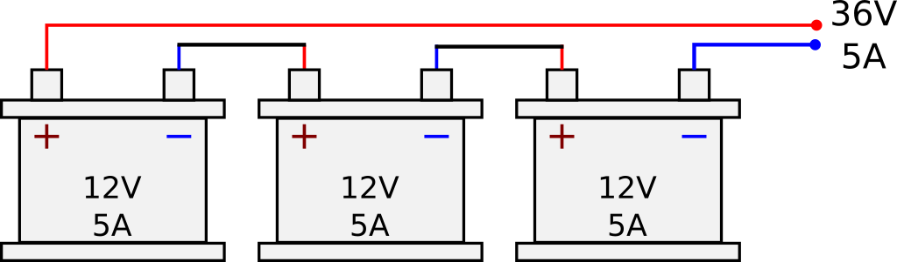
<figcaption>Baterías en serie</figcaption>

Como se muestra en la imagen, son baterías de $12V$ a $5A$. Si se suman sus voltajes, nos quedaría lo siguiente:

$$
V_T = V_{Bat1}+ V_{Bat2} V_{Bat3} = 12V + 12V + 12V = 36V
$$

> La corriente en serie es la misma, en conexiṕn <u>serie</u>.

$$
I_T = I_{Bat1} = I_{Bat3} = I_{Bat3} = 5A
$$

Pero, la corriente sigue siendo la misma a la salida de las conexiones, es decir; a la salida ahora tenemos $36V$ y $5A$.

### Baterías en Paralelo

La conexión en paralelo tiene la misma función, incrementar la potencia, pero de una manera distinta, la forma en que funciona es sumar la corriente de las baterías y así obtener un corriente mucho mayor. De igual forma las baterías deben ser de las mismas características por el peligro que existe de una explosión o incendio.

!!! danger "Precaución"
    Esta configuración tiene varios cuidados, se puede aplicar, pero en lo general no se recomienda.

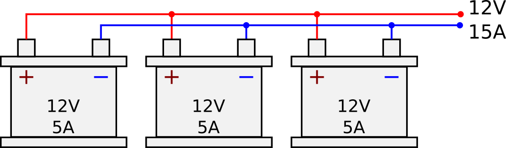
<figcaption>Baterias en paralelo</figcaption>

Como se muestra en la imagen, son baterías de $12V$ a $5A$. Si se suman las corrientes, nos quedaría lo siguiente:

$$
I_T= I_{Bat1} + I_{Bat2} + I_{Bat3} = 15A
$$

> El voltaje es el mismo en conexión <u>paralelo</u>

$$
V_T = V_{Bat1} = V_{Bat2} = V_{Bat3} = 12V
$$

Pero, el voltaje sigue siendo el mismo a la salida de las conexiones, es decir; a la salida ahora tenemos $12V$ y $15A$.

## Ejercicios

Realizar el calculo de voltaje y corriente total en cada uno de los circuitos

| Circuito                                                  | Datos                                | Calculo |
| --------------------------------------------------------- | ------------------------------------ | ------- |
| 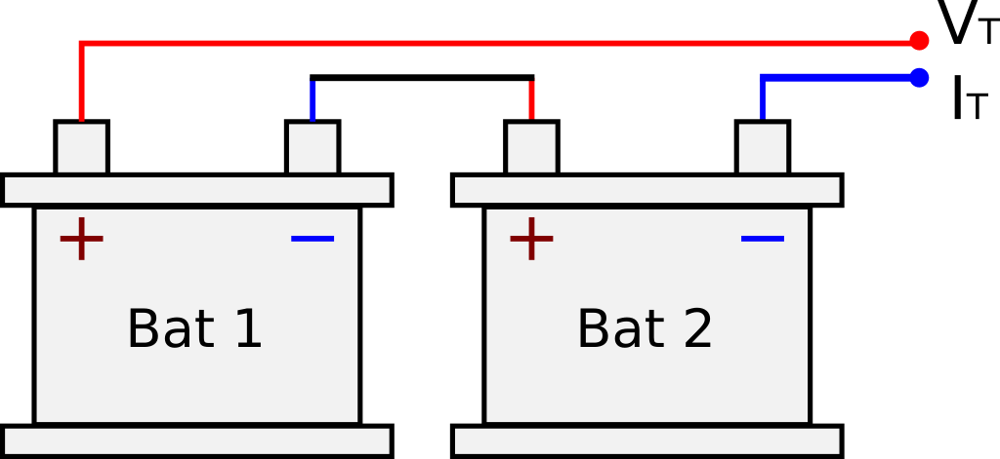       | $V_{bat}=3V$ $I_{bat}=100mA$      |         |
|        | $V_{bat}=6V$ $I_{bat}=350mA$      |         |
| 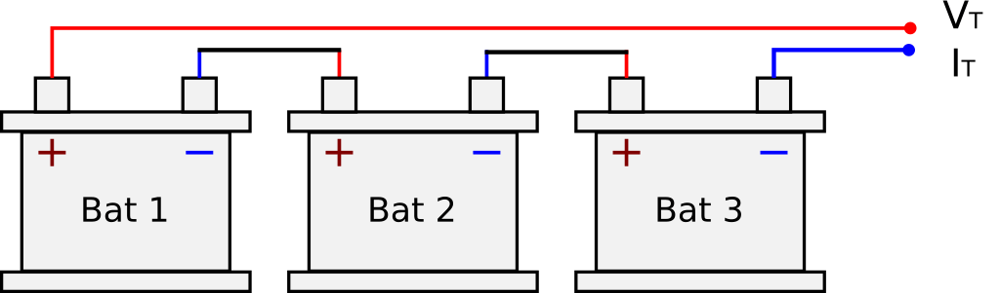       | $V_{bat}=9V$ $I_{bat}=2.5A$       |         |
|        | $V_{bat}=24V$ $I_{bat}=120A$      |         |
| 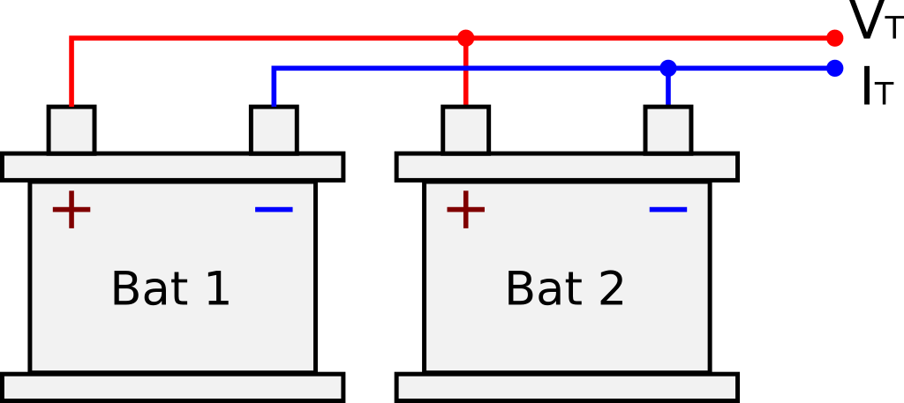 | $V_{bat}=1.5V$ $I_{bat}=50mA$     |         |
|  | $V_{bat}=3V$ $I_{bat}=1000 \mu A$ |         |
| 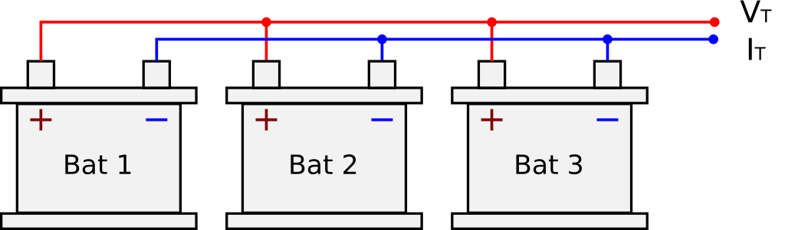 | $V_{bat}=9V$ $I_{bat}=750mA$      |         |
|  | $V_{bat}=48V$ $I_{bat}=10mA$      |         |
| 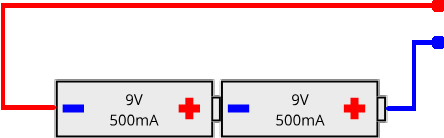        | $V_{bat}=9V$ $I_{bat}=500mA$      |         |
| 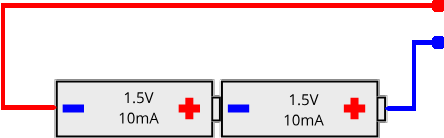        | $V_{bat}=1.5V$ $I_{bat}=10mA$     |         |
| 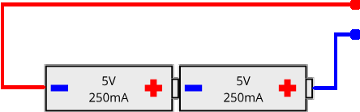        | $V_{bat}=5V$ $I_{bat}=10mA$       |         |
| 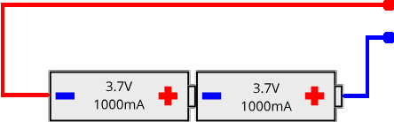        | $V_{bat}=3.7V$ $I_{bat}=500mA$    |         |
| 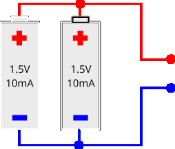        | $V_{bat}=1.5V$ $I_{bat}=10mA$     |         |
| 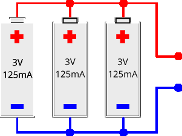        | $V_{bat}=3V$ $I_{bat}=125mA$      |         |
| 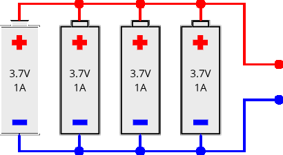        | $V_{bat}=3.7V$ $I_{bat}=1A$       |         |

