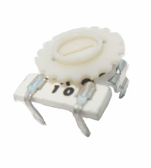
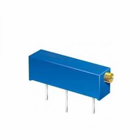

# Potenciómetro

El potenciómetro es una resistencia variable, pero la característica es que puede cambiar su valor óhmico, este contiene un mecanismo que nosotros al mover lo hace cambiar el valor resistivo. Puede varias desde un valor de $0 \Omega$ hasta el valor que indique el cuerpo de la resistencia. Existen muchas variantes en su forma física para hacer el cambio de la resistencia.

## Símbolo

|                Sistema NEMA                 |            Sistema IEC             |
| :-----------------------------------------: | :--------------------------------: |
|    |    |
|  |  |

## Construcción

Consta de 3 terminales, habitualmente los pines del extremo representa el valor total resistivo, y el pin central es el que dará el valor en proporción de la posición de la perilla o vástago.

## Tipos de potenciómetros lineales

Existen varios modelos de resistencias variables, que dependiendo su forma se le puede dar un nombre distinto, sin embargo siguen siendo una resistencia variable.

|                       Nombre                        |                                                                         Modelo                                                                          |
| :-------------------------------------------------: | :-----------------------------------------------------------------------------------------------------------------------------------------------------: |
|                    Potenciómetro                    |  |
|                       Preset                        |                                                                                          |
|                       Preset                        |                                                                                          |
|                       Preset                        |                                                                                          |
| Potenciómetro de precision o multi-vuelta o Trimpot |                                                                                    |
| Potenciómetro de precision o multi-vuelta o Trimpot |                                                                                    |
