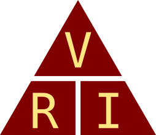
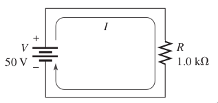
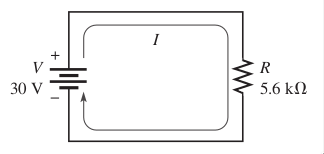
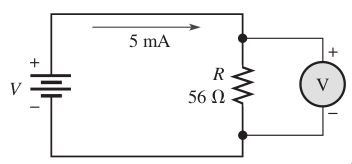
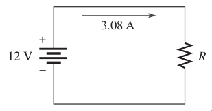
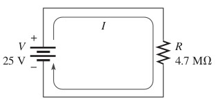
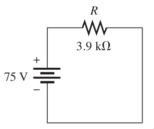
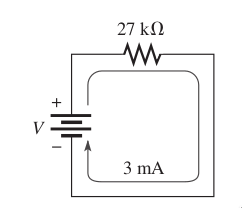
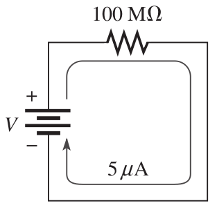

---
tags:
  - ley de ohm
  - básico
---

# Ley de Ohm

!!! info Ley de Ohm
    Establece que la corriente es directamente proporcional al voltaje e inversamente proporcional a la resistencia.


<figcaption>El triangulo de la Ley de Ohm</figcaption>

```markmap
# Ley de Ohm

## Resistencia

- R = V / I

## Corriente

- I = V / R

## Voltaje

- V = (R)(I)
```

## Ejemplos 

!!! example Ejemplo
    **1. ¿Cuántos ampers de corriente hay en el circuito?** <br>
    **Diagrama:** <br>
     <br>
    **Solución:**   <br>
    Aplicando la ley de Ohm, despejamos la corriente y obtenemos 

    $$I=\frac{V}{R}=\frac{50V}{1k \Omega}=50mA$$

!!! example Ejemplo
    **2. Determine la corriente en el circuito mostrado:** <br>
    **Diagrama:** <br>
     <br>
    **Solución:** <br>
    Aplicando la ley de Ohm, despejamos la corriente y obtenemos

    $$I=\frac{V}{R}=\frac{30V}{5.6k \Omega}=5.36mA$$

!!! example Ejemplo
    **3. ¿Cuál es el voltaje en la resistencia R?**<br>
    **Diagrama:**<br>
    **Solución:**<br>
    Aplicando la ley de Ohm, despejamos el voltaje y obtenemos 
     <br>
    $$V=IR = (5mA)(56 \Omega) = 280mV$$

!!! example Ejemplo
    **4. ¿Cuál es el valor óhmico de la resistencia R?**<br>
    **Diagrama:**<br>
    **Solución:**<br>
    Aplicando la ley de Ohm, despejamos la resistencia y obtenemos 
     <br>
    $$R=\frac{V}{I}=\frac{12V}{3.08A}=3.90 \Omega$$

## Ejercicios

!!! note Ejercicio 1
    **1. Determine la corriente en el circuito mostrado:**<br> 
    **Diagrama:** <br> 
     <br>
    **Solución:** <br> 
    <br><br><br><br><br>

!!! note Ejercicio 2
    **2. Determine la corriente en el circuito mostrado:**
    **Diagrama:** <br> 
     <br>
    **Solución:** 
    <br><br><br><br><br>

!!! note Ejercicio 3
    **3. Determine la corriente en el circuito mostrado:**
    **Diagrama:** <br> 
     <br>
    **Solución:** 
    <br><br><br><br><br>

!!! note Ejercicio 4
    **4. Determine la corriente en el circuito mostrado:**
    **Diagrama:** <br> 
     <br>
    **Solución:** 
    <br><br><br><br><br>

