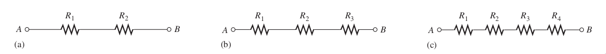
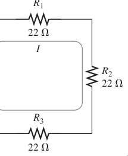
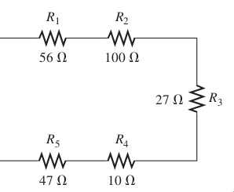
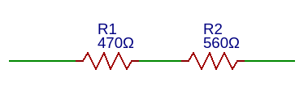
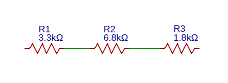
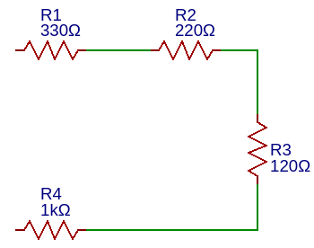
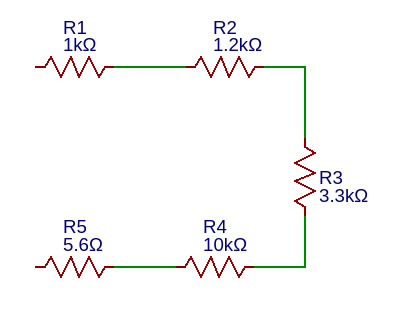

# Resistencias en conexión Serie

Cuando se conectan los resistores y forman una hilera, en la cual existe solo una trayectoria para la corriente.

> Un circuito en serie proporciona solo una trayectoria para el paso de la corriente entre dos puntos, de modo que la corriente es la misma a través de cada resistor en serie.

==**Las resistencias en serie se suman**==, es decir; al estar conectadas una contigua a la otra, en sus terminales, el ahora tendremos la suma de la primera resistencia con la segunda, con esto tenemos una resistencia resultante.

Como se muestra en la imagen, tenemos 3 resistencias, en los extremos de $R1$ y $R3$ se lee el valor total; es decir, nos queda:

$$R_{Total}=R_1 + R_2 + R_3 = 22 \Omega + 22 \Omega + 22 \Omega = 66 \Omega$$

Este valor de resistencia también se conoce como **resistencia equivalente o total**.

**La fórmula para la resistencia equivalente en serie es:**

> $$R_T = R1 + R2 + R3 + ... + R_n$$

Aplicaremos esta fórmula en los circuitos que se muestran:

$$R_T=R1 + R2 + R3 + R4 + R5 = 56 \Omega + 100\Omega + 27\Omega + 10\Omega + 47\Omega$$

$$R_T=240 \Omega$$

El circuito equivalente seria:

!!! Tip 

    Siempre el valor de la resistencia total en serie debe ser mucho mayor que la resistencia más alta en el circuito.

## Ejercicios

!!! example Ejercicio
    **1. Obtener la resistencia total del siguiente circuito**  
    **Diagrama:**   
      
    **Calculo:**     

!!! example Ejercicio
    **2. Obtener la resistencia total del siguiente circuito**  
    **Diagrama**  
      
    **Calculo:**     

!!! example Ejercicio
    **3. Obtener la resistencia total del siguiente circuito**  
    **Diagrama**  
      
    **Calculo:**     

!!! example Ejercicio
    **4. Obtener la resistencia total del siguiente circuito**  
    **Diagrama**  
      
    **Calculo:**     
