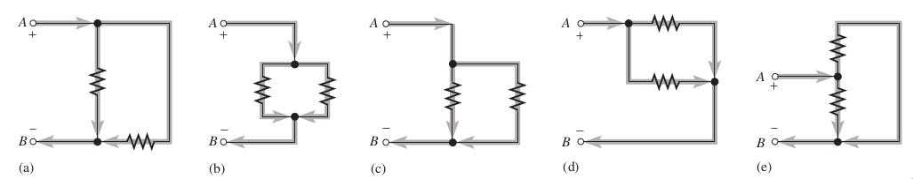
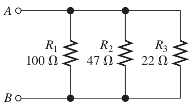
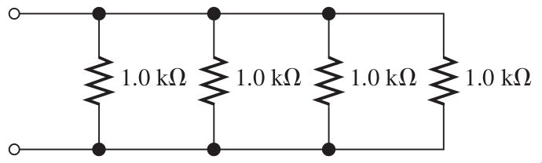
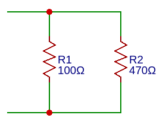
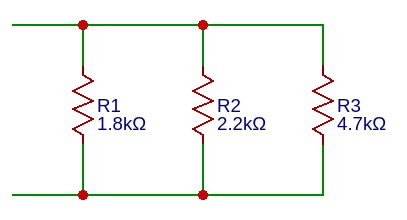
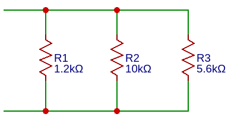
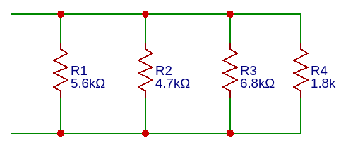
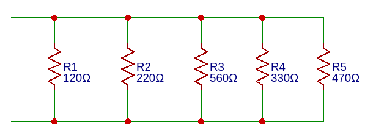

# Resistencias en conexión Paralelo

Cuando dos o más resistencias se conectan individualmente entre dos puntos distintos, están en paralelo entre sí.

> Si existe más de una trayectoria (rama) para la corriente entre dos puntos distintos, y si el voltaje entre dichos puntos también aparece a través de cada una de las ramas, entonces existe un circuito en paralelo entre esos dos puntos.

**==Las resistencias en paralelo es la suma de sus inversos en un inverso==**, es decir; se realiza la suma del inverso de todas las resistencias y una vez se tenga, a esa suma total se aplica un inverso.

Como se muestra en la imagen, tenemos 3 resistencias, en los extremos tenemos conectado un lado de R1, R2 y R3, y por el otro lado igual, en estos extremos se lee su valor total; es decir:

$$R_T= \frac{1}{\frac{1}{R_1}+ \frac{1}{R_2} + \frac{1}{R_3}} = \frac{1}{\frac{1}{100 \Omega}+ \frac{1}{47 \Omega} + \frac{1}{22\Omega}}$$

$$R_T=13.03 \Omega$$

Este valor de resistencia también se conoce como **resistencia equivalente o total.**

**La fórmula para la resistencia equivalente en paralelo es:**

> $$R_T= \frac{1}{\frac{1}{R_1}+\frac{1}{R_2}+\frac{1}{R_3}+\frac{1}{R_4}+ ... + \frac{1}{R_n}}$$

Aplicaremos esta fórmula en los circuitos que se muestran:

$$R_T= \frac{1}{\frac{1}{R_1}+\frac{1}{R_2}+\frac{1}{R_3}+\frac{1}{R_4}} = \frac{1}{\frac{1}{1k\Omega}+\frac{1}{1k\Omega}+\frac{1}{1k\Omega}+\frac{1}{1k\Omega}}$$

$$R_T = 250 \Omega$$

El circuito equivalente seria:

!!! Tip
    
    Siempre el valor de la resistencia total en paralelo debe ser mucho menor que la resistencia más pequeña en el circuito.

## Ejercicios

!!! example Ejercicio
    **1. Obtener la resistencia total del siguiente circuito**  
    **Diagrama**  
      
    **Calculo:**  

!!! example Ejercicio
    **2. Obtener la resistencia total del siguiente circuito**  
    **Diagrama**  
      
    **Calculo:**  

!!! example Ejercicio
    **3. Obtener la resistencia total del siguiente circuito**  
    **Diagrama**  
      
    **Calculo:**  

!!! example Ejercicio
    **4. Obtener la resistencia total del siguiente circuito**  
    **Diagrama**  
      
    **Calculo:**  

!!! example Ejercicio
    **5. Obtener la resistencia total del siguiente circuito**  
    **Diagrama**  
      
    **Calculo:**  