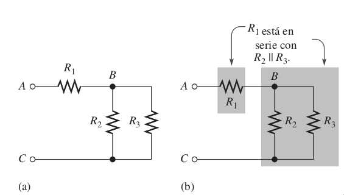
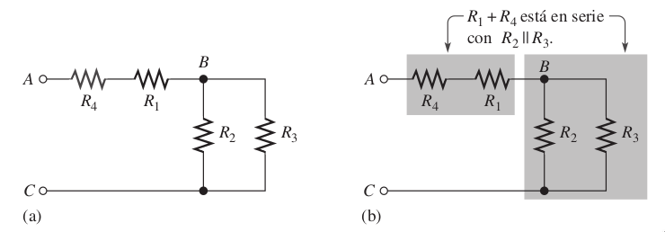
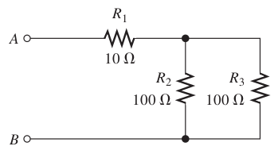

# Resistencias en conexión Serie-Paralelo (Mixto)

La conexión de resistencia en la forma mixta, es la combinación de las dos anteriormente vistas. Es decir, tenemos que observar cuáles se encuentran en paralelo y cuáles en serie e ir haciendo la reducción hasta obtener la resistencia equivalente.

En la figura podemos observar que R2 y R3 están en paralelo, por lo tanto, se resuelve por paralelo y a esa resistencia total queda en serie con R1, nos quedaría realizar la suma y obtener la resistencia total.

En ese siguiente ejemplo, tenemos en paralelo a $R2$ y $R3$, resolvemos ese paralelo. Ahora $R1$ y $R4$ están en serie, por lo tanto aplicamos la fórmula, una vez tenemos el resultado del paralelo $R2R3$ y el resultado de la serie $R1R4$, nos quedan en serie, solo nos queda hacer esa suma y obtener la resistencia total.

## Ejemplos

!!! example Ejemplo
    **1. Obtener la resistencia equivalente del circuito**  
    **Diagrama:**  
      
    **Solución:**    
    Observamos el paralelo de $R2$ con $R3$ ($R2||R3$)

    $$R_{23}=\frac{1}{\frac{1}{R_2}+\frac{1}{R_3}}=\frac{1}{\frac{1}{100\Omega}+\frac{1}{100\Omega}}=50\Omega$$

    Ahora, nos queda $R1$ en serie con $R2||R3$, solo nos queda realizar la suma:

    $$R_T=R_1 + R_{23} = 10\Omega + 50\Omega$$

    > $$R_T=60\Omega$$

## Ejercicios

!!! example Ejercicio
    **1. Obtener la resistencia equivalente del circuito**  
    **Diagrama:**  
      
    **Solución:**     
