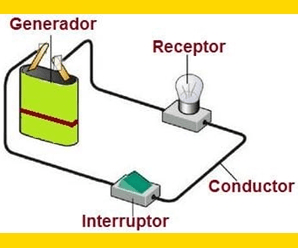

# Circuitos eléctricos

## ¿Qué es un circuito eléctrico?

Es un sistema conformado por una fuente de energía, un medio que lleva la corriente y una carga que consume esta energía.



## Circuitos resistivos

Son aquellos circuitos que comprenden de una fuente de energía y puros elementos **resistivos**. Es decir, no cuenta con algún otro tipo de elemento capacitivo, inductivo, semiconductor, etc.

```markmap
# Circuitos eléctricos resistivos

- En cada circuito los valores resistivos, de voltaje y corriente tienen un comportamiento distinto

## Circuito serie

- **Voltaje**: Se distribuye en todas las cargas
- **Corriente**: Es la misma en todas las cargas
- **Resistencia**: Se suman

## Circuito paralelo

- **Voltaje**: Es el mismo en todas las cargas
- **Corriente**: Se distribuye en todas las cargas
- **Resistencia**: Se reduce de manera inversamente proporcional

## Circuito mixto

- Se aplica la regla en función de la conexión de las resistencias en ese momento

```
