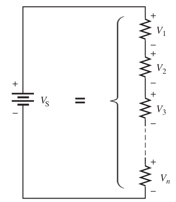
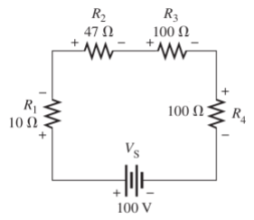
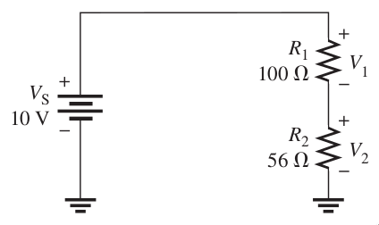
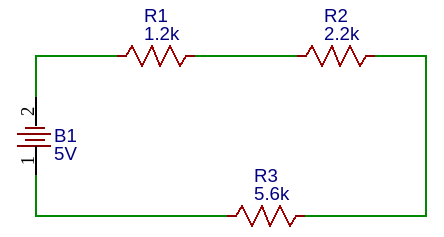
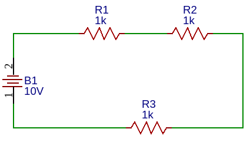
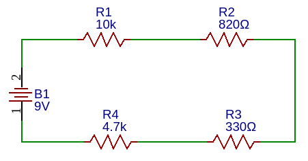
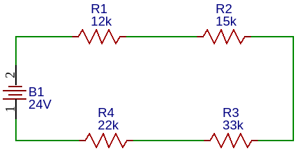

# Circuitos en Serie Resistivo

Un circuito serie se base en lo previamente visto con relación a la *conexión de resistencias*, pero ahora tenemos que conocer las reglas que aplican con respecto al voltaje y la corriente.

**Reglas que debemos grabarnos son el comportamiento del voltaje y la corriente en circuitos serie:**

> Voltaje: En un circuito serié se distribuye el voltaje entre todas las cargas (resistencias)

> Corriente: La corriente es la misma en todas las cargas (resistencias).

<figcaption>La suma de n caídas de voltaje es igual al voltaje de la fuente. La corriente es la misma en todas las secciones del circuito.</figcaption>

## Comportamiento de voltaje y corriente en Serie
### Ecuación de Voltaje

El voltaje total es igual a la suma de las caídas de tension:

> $$V_T=V_1+V_2+V_3+V_4+V_5+ ... + V_n$$

### Ecuación de corriente

La corriente es igual es todos los elementos del circuito

> $$I_T=I_1=I_2=I_3=I_4=I_5=... =I_n$$

## Ejemplos

!!! example Ejemplo
    **1. Necesitamos conocer el voltaje en cada resistencia y la corriente total:**  
    **Diagrama:**  
      
    **Solución:**    
    1. Para ello primero calculamos la Resistencia total, para obtener la corriente total del circuito.

    Dado que vemos que todas las resistencias están serie, las vamos a sumar

    $$R_T=R_1 +R_2 +R_3 + R_4$$

    $$R_T= 10\Omega + 47\Omega + 100\Omega+ 100\Omega $$

    > $$R_T=257\Omega$$

    2. Ya que tenemos la *Resistencia total*, podemos hacer el cálculo de la *Corriente total*, aplicamos ley de ohm:

    > $$I=\frac{100V}{257 \Omega} = 389.1 mA$$

    3. Ahora podemos calcular el voltaje en cada resistencia, aplicamos ley de ohm:

    $$V_{R1} = (10 \Omega)(389.1mA)=3.891V$$

    $$V_{R2} = (47 \Omega)(389.1mA)=18.28V$$

    $$V_{R3} = (100 \Omega)(389.1mA)=38.91V$$

    $$V_{R4} = (100 \Omega)(389.1mA)=38.91V$$

    4. Para la comprobación, debemos sumar todos los voltajes y nos debe dar el valor de la fuente:

    > $$V_T= 3.891V + 18.28V + 38.91V +38.91V= 99.99V$$

    Comparando el dato del circuito y el que calculamos, es prácticamente el mismo:
    > $$100V \approx 999.99V$$

!!! example Ejemplo
    **2. Necesitamos conocer el voltaje en cada resistencia y la corriente total:**  
    **Diagrama:**  
      
    **Solución:**    
    1. Para ello primero calculamos la Resistencia total, para obtener la corriente total del circuito.

    Dado que vemos que todas las resistencias están serie, las vamos a sumar

    $$R_T=R_1 +R_2$$

    $$R_T= 100\Omega + 56\Omega$$

    > $$R_T=156\Omega$$

    2. Ya que tenemos la *Resistencia total*, podemos hacer el cálculo de la *Corriente total*, aplicamos ley de ohm:

    > $$I=\frac{10V}{156 \Omega} = 64.1mA$$

    3. Ahora podemos calcular el voltaje en cada resistencia, aplicamos ley de ohm:

    $$V_{R1} = (100 \Omega)(64.1mA)=6.41V$$

    $$V_{R2} = (56 \Omega)(64.1mA)=3.59V$$

    4. Para la comprobación, debemos sumar todos los voltajes y nos debe dar el valor de la fuente:

    > $$V_T= 6.41V + 3.59V= 10V$$

    Comparando el dato del circuito y el que calculamos, es prácticamente el mismo:
    > $$10V = 10V$$

## Ejercicios

!!! example Ejercicio
    **1. Necesitamos conocer el voltaje en cada resistencia y la corriente total:**  
    **Diagrama:**  
      
    **Solución:**     

!!! example Ejercicio
    **2. Necesitamos conocer el voltaje en cada resistencia y la corriente total:**  
    **Diagrama:**  
      
    **Solución:**     

!!! example Ejercicio
    **3. Necesitamos conocer el voltaje en cada resistencia y la corriente total:**  
    **Diagrama:**  
      
    **Solución:**     

!!! example Ejercicio
    **3. Necesitamos conocer el voltaje en cada resistencia y la corriente total:**  
    **Diagrama:**  
      
    **Solución:**     
