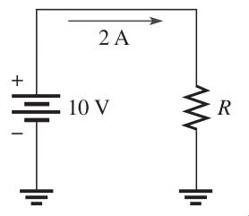
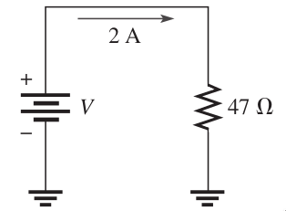
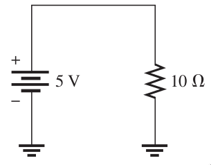
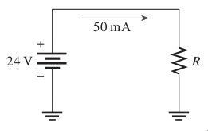
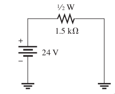
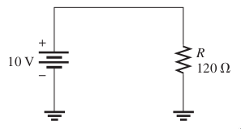

# Potencia (Eléctrica)

Cuando circula corriente a través de una resistencia, las colisiones de los electrones producen calor a consecuencia de la conversión de la energía eléctrica. La potencia se mide en Watts (W). A esto se le conoce como la **Ley de Watt**.

A continuación se muestran las ecuaciones de Ley de Ohm en combinación de Ley de Watt.

!!! note "Voltaje"
    $$V = \frac{P}{I}$$

    $$V = \sqrt{P \times R}$$

!!! note "Corriente"
    $$I = \frac{P}{V}$$

    $$I = \sqrt{\frac{P}{R}}$$

!!! note "Resistencia"
    $$R = \frac{V^2}{P}$$

    $$R = \sqrt{\frac{P}{I^2}}$$

!!! note "Potencia"
    $$P = V \times I$$

    $$P = I^2 \times R$$

    $$P = \frac{V^2}{R}$$

## Ejemplo

!!! example "Ejemplo"
    **1. Calcula la potencia en el circuito**  
    **Diagrama:**  
      
    **Solución:** 
    Aplicando la ley de Watt, despejamos la potencia y obtenemos

    $$P=VI = (10V)(2A) = 20W$$

!!! example Ejemplo
    **2. Calcula la potencia en el circuito**  
    **Diagrama:**  
      
    **Solución:**  
    Aplicando la ley de Watt, despejamos la potencia y obtenemos

    $$P=I^2 R = (2A)^2 (47 \Omega) = 188W$$

!!! example Ejemplo
    **3. Calcula la potencia en el circuito**  
    **Diagrama:**  
      
    **Solución:**  
    Aplicando la ley de Watt, despejamos la potencia y obtenemos

    $$P= \frac{V^2}{R} = \frac{(5V)^2}{10 \Omega} = 2.5W$$

## Ejercicios

Aplicando Ley de Watt

!!! note Ejercicio 1
    **1. Calcula la potencia en el circuito:**  
    **Diagrama:**  
      

!!! note Ejercicio 2
    **2. Calcula la potencia en el circuito:**  
    **Diagrama:**  
      

!!! note Ejercicio 3
    **3. Calcula la potencia en el circuito:**  
    **Diagrama:**  
      
