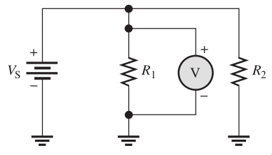
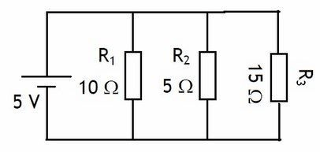

# Circuitos en Paralelo Resistivo

Un circuito en paralelo se base en lo previamente visto con relación a la conexión de resistencias, pero ahora tenemos que conocer las reglas que aplican con respecto al voltaje y la corriente.

**Reglas que debemos grabarnos son el comportamiento del voltaje y la corriente en circuitos serie:**

> - **Voltaje**: Es el mismo en todos los elementos.
> - **Corriente**: La corriente se distribuye entre todos los elementos.

<figcaption>La suma de n bifurcaciones de corriente es igual al total de la corriente del circuito. El voltaje en cada resistencia es igual al voltaje de la fuente.</figcaption>

## Comportamiento de voltaje y corriente en Serie

### Ecuación de Voltaje

El voltaje total es igual es todos los elementos del circuito:

> $$V_T=V_1=V_2=V_3=V_4=V_5= ... = V_n$$

### Ecuación de corriente

La corriente se distribuye en todos los elementos

> $$I_T=I_1+I_2+I_3+I_4+I_5+... +I_n$$

## Ejemplos

!!! example Ejemplo
    **1. Necesitamos conocer el voltaje  y la corriente en cada elemento como el total:**  
    **Diagrama:**  
      
    **Solución:**    

## Ejercicios
