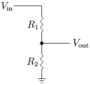
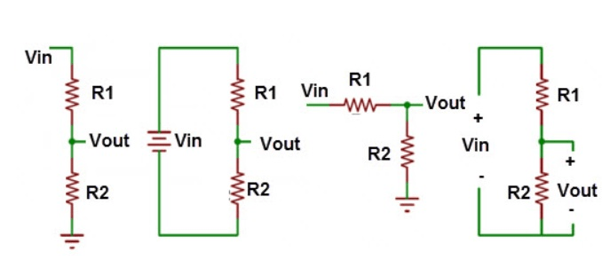

# Divisor de tension

El divisor de tensión es una configuración de resistencia, con una amplia aplicación de muchas operaciones electrónicas. Se utiliza para generar un nivel de tensión que necesitemos. Es muy versátil su uso y aplicación. 

Se trata de tan solo tener como mínimo 2 resistencias en serie y tomar el voltaje a la mitad, en caso de tener más resistencias se puede distribuir y tener más señales de referencia.

La configuración es como se muestra: 

Como podemos observar en el circuito que hay dos resistencias en serie y la medición de voltaje se realiza en la unión de las dos, todo esto referenciado a tierra.

Te muestro las variantes que puedes observar, esto es simplemente visual, con relación al comportamiento es lo mismo:

La fórmula que vamos a emplear y conocer cuál será el voltaje de salida:

> $$V_{out} = V_{in} \frac{R2}{R1+R2} $$

## Ejemplos

!!! example Ejemplo
    **1. Si tenemos un $V_{in} = 5V$ y una $R_1=R_2=1k\Omega$. ¿Cuál es el voltaje de salida?**  
    **Diagrama:**  
      
    **Solución:**    
    Aplicamos la forma de divisor de tension:
    
    $$V_{out} = V_{in} \frac{R2}{R1+R2} = (5V) \frac{1k\Omega}{1k\Omega + 1k\Omega}$$

    $$V_{out} = (5V) \frac{1k\Omega}{2k\Omega}$$
    
    Nos da un voltaje de salida:

    >$$V_{out} = 2.5V$$

!!! example Ejemplo
    **2. Si tenemos un $V_{in} = 9V$ y una $R_1 = 1.2k\Omega$ y una $R_2 = 5.6k\Omega$. ¿Cuál es el voltaje de salida?**  
    **Diagrama:**  
      
    **Solución:**    
    Aplicamos la forma de divisor de tension:
    
    $$V_{out} = V_{in} \frac{R2}{R1+R2} = (9V) \frac{5.6k\Omega}{1.2k\Omega + 5.6k\Omega}$$

    Nos da un voltaje de salida:

    >$$V_{out} = 7.4V$$

!!! example Ejemplo
    **3. Si tenemos un $V_{in} = 24V$ y una $R_1 = 10k\Omega$ y una $R_2 = 100k\Omega$. ¿Cuál es el voltaje de salida?**  
    **Diagrama:**  
      
    **Solución:**    
    Aplicamos la forma de divisor de tension:
    
    $$V_{out} = V_{in} \frac{R2}{R1+R2} = (24V) \frac{100k\Omega}{10k\Omega + 100k\Omega}$$

    Nos da un voltaje de salida:

    >$$V_{out} = 24.81V$$

## Ejercicios

!!! example Ejercicio
    **1. Si tenemos un $V_{in} = 12V$ y una $R_1 = 5.6k\Omega$ y una $R_2 = 10k\Omega$. ¿Cuál es el voltaje de salida?** 
    **Diagrama:**  
      
    **Solución:**     

!!! example Ejercicio
    **1. Si tenemos un $V_{in} = 5V$ y una $R_1 = 10k\Omega$ y una $R_2 = 10k\Omega$. ¿Cuál es el voltaje de salida?** 
    **Diagrama:**  
      
    **Solución:**     

!!! example Ejercicio
    **1. Si tenemos un $V_{in} = 48V$ y una $R_1 = 10k\Omega$ y una $R_2 = 1k\Omega$. ¿Cuál es el voltaje de salida?** 
    **Diagrama:**  
      
    **Solución:**     