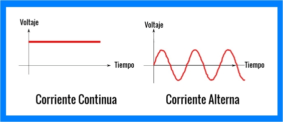

# Corriente directa o continua y Corriente alterna

De manera general existen dos tipos de corrientes, la corriente alterna y la corriente directa, sus aplicaciones dependen de nuestra carga; es decir, con cuál corriente vaya a operar, existen dispositivos que pueden operar con cualquiera, pero esos casos son especiales.

**En esencia son lo mismo, es un flujo de electrones, su punto diferencial principal es su comportamiento en el tiempo y un segundo diferenciador es la dirección de la corriente o la polaridad, pero esto no es siempre.**

## La corriente directa o continua

Entre la corriente continua y directa hay diferencias sutiles, aunque en muchas ocasiones se toman por igual porque en normalmente funcionan para lo mismo.
En concreto, la corriente directa se llama así porque la corriente es constante en el tiempo, es decir, no varían y se mantiene estable.

<!-- agregar una imagen representativa -->

## La corriente alterna

Es llamada así porque varía en el tiempo, no se mantiene constante, todo el tiempo está teniendo una variación, pero esta variación u oscilación es constante de cierta manera.

<!-- agregar una imagen representativa -->

