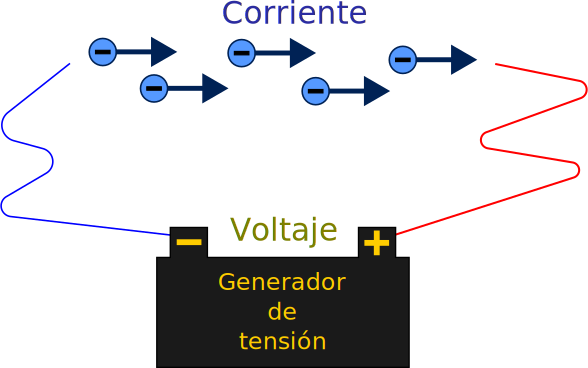

# Introudccion a Electrónica basíca - Conceptos basicos

## Conceptos básicos
## Conductor y Aislante
### Conductor

Es un elemento el cual tiene la capacidad para conducir electricidad. Fluye fácilmente la corriente sobre él, sin poner resistencia a su paso.

Ejemplos de ellos son:

- El cobre
- La plata
- El oro
 
### Aislante

Es un elemento el cual se opone al total flujo de corriente eléctrica sobre él.
Ejemplos de ello son:

- El plástico
- El hule
- El aire

## Voltaje

La diferencia en la energía potencial por cargas es la diferencia de potencial o voltaje, En circuitos eléctricos, el voltaje es la fuerza propulsora y es lo que estable la corriente.

> Diferencia de potencial.

## Corriente

> Cantidad de electrones que pasan en un punto en unidad de tiempo.

{ width="80%"}
<figcaption>Ejemplo del desplazamiento de los electrones</figcaption>

## Resistencia

> Es la oposición al paso de la corriente.

