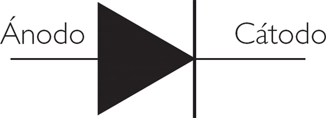
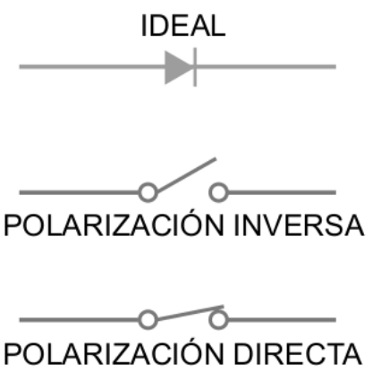
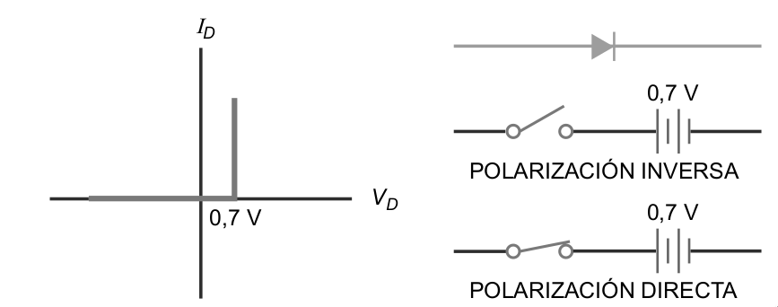
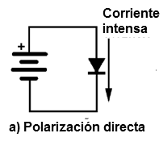
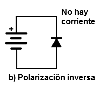

# Diodo

> El diodo es el elemento más básico de los semiconductores, a partir de él se crearon los demás. 

## Diodo ideal

Es un dispositivo de dos terminales, un lado llamado Ánodo, que será el lado positivo (+) y Cátodo, que será el lado negativo (-). De forma ideal un diodo conducirá corriente en la dirección definida por la flecha que muestra su símbolo y actuara como un circuito abierto ante cualquier intento por establecer corriente en la disección opuesta.

*Las características de un diodo ideal son las mismas que un interruptor que solo permite la conducción de la corriente es una sola dirección.*

Vemos en la imagen siguiente su comportamiento ideal, en sus diversos estados:

## Diodo Real

Sin embargo, lo ideal solo existe en concepto, porque en realidad tiene un comportamiento un poco distinto. Dependiendo de con que material esté construido, tendrá una caída de tensión, si se polariza inversamente, tiene una corriente de fuga pequeña, si sobrepasamos ciertos parámetros se daña pierde sus propiedades.

|Material |Caída de tensión
|:-|:-:|
|Germanio|0.3V
|Silicio|0.7V

Por lo tanto, aquí ya no es ideal, como vemos depende de que diodo estemos hablando debemos tener ciertos criterios al momento del cálculo.
El comportamiento real se muestra en el siguiente gráfico:

Su configuración más acercada la realidad es que es un interruptor con una pila, (*existe otra a más detalle que no se tratara aquí*).
Ahora necesitamos comprender dos conceptos importantes para el diodo, que es sus tipos de polarización y que sucede en cada caso.

### Polarización directa

Esto significa que cuando es conectado a una fuente de voltaje el lado positivo de la fuente se conecta al ánodo o positivo del diodo, y el lado negativo de la fuente es conectado al cátodo o negativo del diodo. En este tipo de conexión el diodo se comporta con un conductor y deja pasar toda la corriente que pase en el circuito.

Como se muestra en la imagen:

### Polarización inversa

Esto significa que cuando es conectado a una fuente de voltaje el lado positivo de la fuente se conecta al cátodo o negativo del diodo, y el lado negativo de la fuente es conectado al ánodo o positivo del diodo. En este tipo de conexión el diodo se comporta como un interruptor abierto no dejando circular corriente por él.

Como se muestra en la imagen:

## Circuitos con diodos

Los datos bases con los que siempre vamos a contar cuando tenemos circuitos con diodos es el voltaje que cae en él, por default siempre vamos a tomar que se trata de un diodo de silicio con un voltaje de 0.7V, en general, a menos que en la descripción nos indique que sea de germanio, entonces el valor será de 0.3V. Otro dato importante es conocer la potencia máxima que soporta el diodo, para así saber si será capaz de soportar la corriente que fluya en él.

## Ejemplos

## Ejercicios

