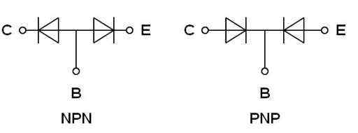
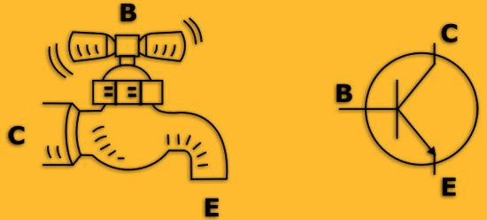

# Semiconductor - Transistores (BJT)

El transistor es otro semiconductor el cual viéndose de una manera fundamental es la combinación de 2 diodos ideales, pero con un pin extra, que es el encargado del control para el paso de corriente. **El transistor amplifica corriente.**

El transistor es un dispositivo semiconductor de tres capas que consta de dos capas de material tipo n y una de material tipo p o de dos capas de material tipo p y una de material tipo n. El primero se llama transistor **NPN** y el segundo transistor **PNP**.

Cada terminal tiene un nombre:

- Colector (**C**)
- Base (**B**)
- Emisor (**E**)

*Su funcionamiento se compara a una llave de agua, la perilla (la base) es la que manipulamos para dejar pasar el agua de un lado (Emisor) al otro (Colector)*. Como se muestra en la imagen:

La función principal del transistor es amplificar corriente y como Switch o conmutador. En este curso solo nos enfocaremos en la segunda para fines prácticos y aplicativos. Existen diversas formas de aplicar y combinar los transistores. La magia en ellos es que con una corriente muy pequeña se pueden lograr controlar corrientes muy altas.
Existen 3 formas de conectar el transistor, se le llama conexión a común porque indica que ese pin va a tierra o al punto en común de la referencia de voltaje:

- Emisor común
- Colector común
- Base común (Será tratada en el curso)
