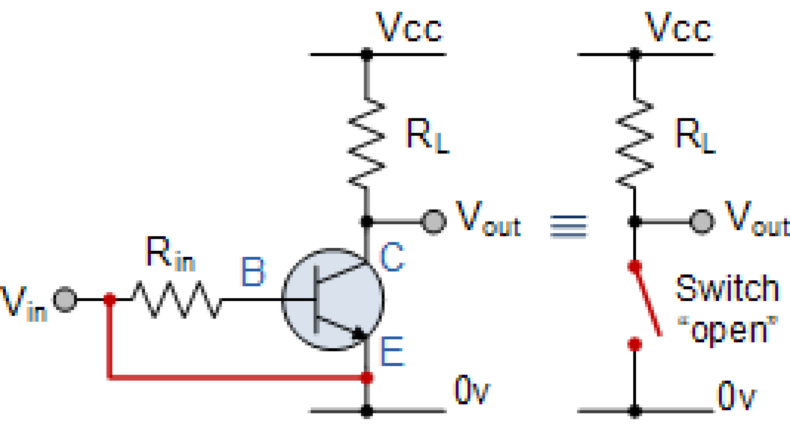
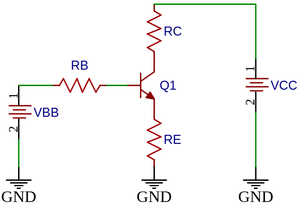
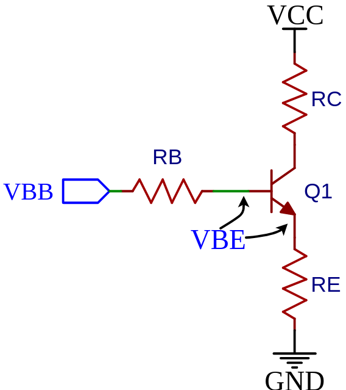
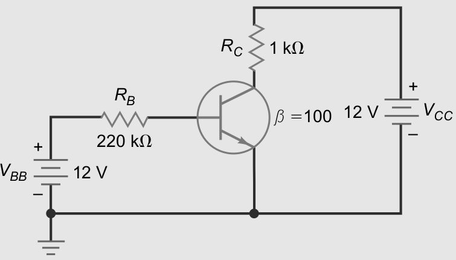
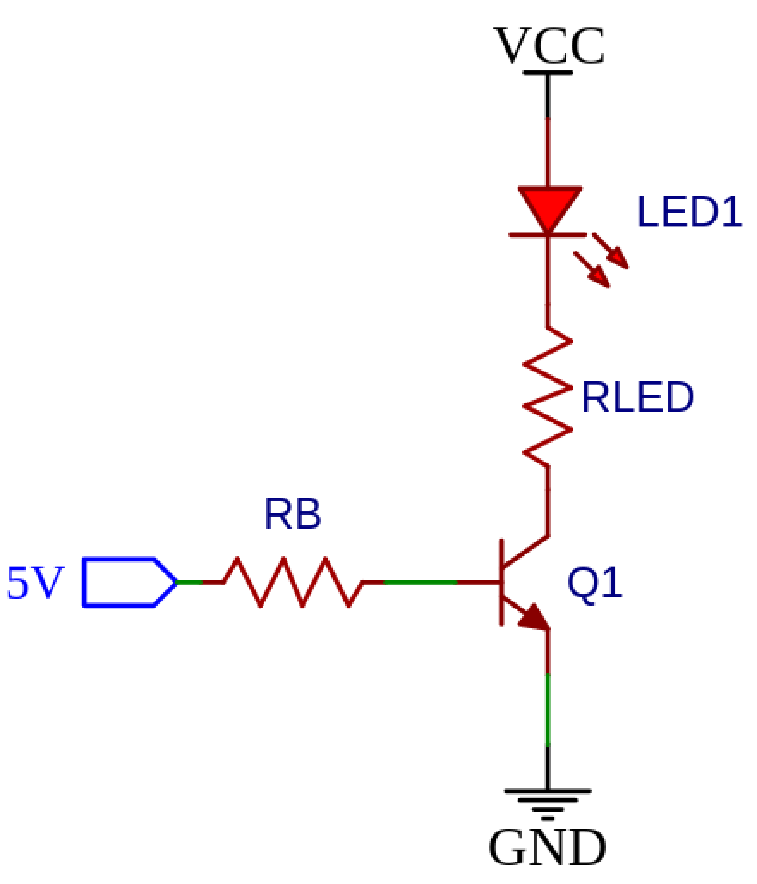
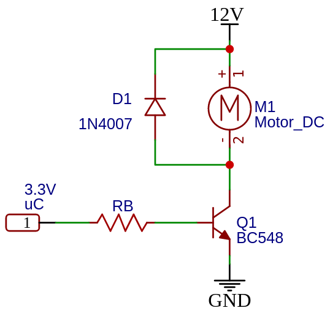
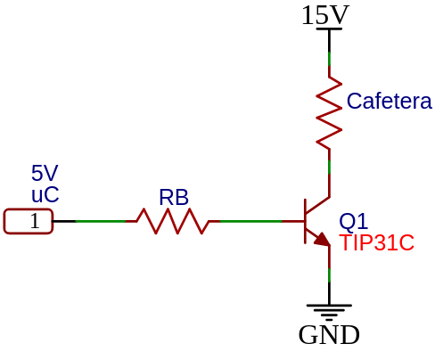

# Transistor como Switch (Corto-Saturación)

Una de las aplicaciones básicas de un **BJT** (*transistor bipolar*) es utilizarlo para el control de cargas grandes que pueden ser activadas con corrientes muy pequeñas, esto significa que el transistor se usara como un interruptor, es decir, estará trabajando en sus dos extremos los cuales son Corte (No conduce) y Saturación (Conduce con relación a la base).

Esta aplicación es muy útil cuando el elemento que manda la señal no puede dar corrientes o voltajes relativamente altos, entonces, utilizamos a un transistor o varios en combinación para amplificar esa señal recibida y con ello activar una carga más grande o mandar una señal más estable y con mayor potencia.

Antes de poder utilizar un transistor debemos conocer varios de sus parámetros y comportamientos.

- La conexión que utilizaremos siempre será en Emisor común (esto porque el emisor se conecta a tierra)
- La ganancia del transistor se llama Beta ($\beta$)
- La corriente que existe en el Emisor es prácticamente igual a la del Colector
- El voltaje de Base-Emisor es de 0.7V (*Es un diodo que existe ahí*)
- SIEMPRE debe llevar una resistencia la Base
- Siempre estaremos usando el transistor NPN

La conexión que estaremos utilizando es la siguiente:

## Circuitos con Transistores

Vamos a realizar el análisis del circuito básico con un transistor utilizado como interruptor. Es el mismo análisis para todos y la formulas son las mismas.
En el siguiente esquemático podemos ver el diagrama de una forma completa, para fines práctico esto se reducirá a la simbología más necesaria o compacta.

> Nota: La resistencia de Emisor no siempre se coloca.

A continuación el circuito simplificado:

Nomenclatura:

- VBB: Voltaje de alimentación de Base
- VCC: Voltaje de alimentación de Colector
- RB: Resistencia de Base
- RC: Resistencia de Colector
- RE: Resistencia de Emisor
- Q: Transistor
- VC: Voltaje de Resistencia de Colector
- VE: Voltaje de Resistencia de Emisor
- VB: Voltaje de Resistencia de Base
- VBE: Voltaje Base-Emisor (0.7V)

## Ejemplos

!!! example "Ejemplo 1"

    Del siguiente circuito debemos, tenemos una $\beta = 300$, calcular $I_B$, $I_C$, $V_{CE}$

    

!!! example "Ejemplo 2"

    Del siguiente circuito debemos, tenemos una $\beta = 300$, calcular $I_B$, $I_C$, $V_{CE}$

    

!!! example "Ejemplo 3"

    Hasta el momento nos están dando las resistencias, pero en un caso de aplicación nosotros debemos realizar los cálculos con base a nuestra carga. Queremos alimentar un LED de potencia que consume 2.5V a 50mA, con un voltaje de 5V, con una señal de 5V (VBB) necesitamos obtener la resistencia de Base, Resistencia de colector (en caso de que sea necesaria). Usaremos un transistor 2N2222 con una ganancia de 75. [Ir a datasheet](https://www.electroschematics.com/wp-content/uploads/2009/04/2n2222-datasheet.pdf)

    

!!! example "Ejemplo 4"

    Debemos activar un motor DC Modelo FC280RA-2865, con un transistor [BC548](https://www.mouser.com/datasheet/2/149/BC547-190204.pdf), las características del [motor](https://www.electronicoscaldas.com/datasheet/FC280RA-FC280SA_Mazhida.pdf) son, 3V a 0.91A con carga, la señal o voltaje con la que se activara viene de un microcontrolador de 3.3V. La fuente que alimentara al motor es de 12V.
    

!!! example "Ejemplo 5"
    Tenemos que accionar una cafetera eléctrica para automóvil, la cual opera a un voltaje de 12V con un consumo de potencia de 24W, la necesitamos controlar con un microcontrolador a 5V, el transistor que vamos a usar es el [TIP31C](https://www.hobbytronics.co.uk/datasheets/TIP31.pdf). La fuente con la que se alimentara la cafetera es de 15V. Analizar si se coloca una resistencia en Emisor.

    
